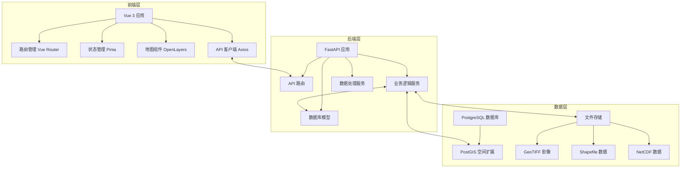

# Vue Map 项目 Code Wiki

## 1. 项目概述

Vue Map 是一个基于 Vue 3、OpenLayers 与 FastAPI 的地理数据管理平台，提供地图浏览、地质数据检索、上传解析、认证与统计分析能力。

### 1.1 主要功能

- ✅ 用户登录和注册界面
- ✅ 侧边栏导航布局
- ✅ OpenLayers 2D 地图
- ✅ Vue Router 路由管理
- ✅ Pinia 状态管理
- ✅ Axios API 服务集成
- ✅ JWT Token 认证
- ✅ PostgreSQL/PostGIS 空间数据支持
- ✅ GeoTIFF / Shapefile / NetCDF 等地理数据处理

### 1.2 技术栈

| 分类 | 技术 | 版本 | 用途 |
|------|------|------|------|
| 前端框架 | Vue 3 | - | 渐进式 JavaScript 框架 |
| 类型系统 | TypeScript | - | 类型安全的 JavaScript |
| 构建工具 | Vite | - | 下一代前端构建工具 |
| 路由管理 | Vue Router | - | 官方路由管理器 |
| 状态管理 | Pinia | - | Vue 的状态管理库 |
| 地图库 | OpenLayers | - | 高性能 2D 地图库 |
| HTTP 客户端 | Axios | - | HTTP 客户端 |
| UI 组件库 | Element Plus | - | 基于 Vue 3 的 UI 组件库 |
| 后端框架 | FastAPI | - | 现代、快速的后端 API 框架 |
| ORM | SQLAlchemy | - | Python ORM 框架 |
| 数据库 | PostgreSQL + PostGIS | - | 空间数据库 |

## 2. 项目架构

### 2.1 整体架构

Vue Map 采用前后端分离的架构设计，前端负责用户界面和交互，后端负责数据处理和 API 服务。



### 2.2 目录结构

```
vue-map/
├── backend/              # 后端服务
│   ├── app/              # 应用逻辑 (DDD)
│   │   ├── api/v1/       # 路由接口
│   │   ├── core/         # 核心配置
│   │   ├── models/       # 数据库模型
│   │   └── services/     # 业务服务
│   ├── tests/            # 后端测试
│   └── requirements.txt  # Python 依赖
├── src/                  # 前端源码
│   ├── api/              # API 服务
│   ├── components/       # 组件
│   ├── composables/      # 组合式函数
│   ├── layouts/          # 布局组件
│   ├── router/           # 路由配置
│   ├── stores/           # Pinia 状态管理
│   ├── views/            # 页面组件
│   ├── App.vue           # 根组件
│   └── main.ts           # 入口文件
├── index.html            # HTML 模板
├── package.json          # 前端依赖配置
└── vite.config.ts        # Vite 配置
```

## 3. 前端模块

### 3.1 核心模块

#### 3.1.1 地图核心 (useMapCore)

**功能**：负责初始化和管理地图实例，提供地图基础操作。

**关键函数**：
- `initMap(container, options)`：初始化 OpenLayers 地图实例
- `mapReady`：响应式状态，表示地图是否初始化完成

**文件位置**：[src/composables/useMapCore.ts](file:///Users/mengzh/Desktop/vue-map/src/composables/useMapCore.ts)

#### 3.1.2 地图图层 (useMapLayers)

**功能**：管理地图图层，包括底图、矢量层、栅格层等。

**关键函数**：
- `addOSMLayer()`：添加 OpenStreetMap 底图
- `addEsriSatelliteLayer()`：添加 Esri 卫星影像
- `addTDTLayer(type)`：添加天地图图层
- `addClusterLayer(source, distance, name)`：添加聚类图层
- `addHeatmapLayer(source, radius, blur)`：添加热力图图层
- `addStaticImageOverlayLayer(options)`：添加静态图片覆盖层
- `removeLayer(key)`：移除指定图层

**文件位置**：[src/composables/useMapLayers.ts](file:///Users/mengzh/Desktop/vue-map/src/composables/useMapLayers.ts)

#### 3.1.3 地图交互 (useMapInteractions)

**功能**：处理地图交互事件，如点击、拖拽、绘制等。

**关键函数**：
- `initInteractions(featureClickHandler, boxSelectionHandler, blankClickHandler, identifyHandler)`：初始化地图交互
- `toggleDragBox()`：切换拖拽框选择功能
- `startDrawing(type, callback)`：开始绘制
- `stopDrawing()`：停止绘制
- `flyTo(coords, zoom)`：平滑飞行到指定位置

**文件位置**：[src/composables/useMapInteractions.ts](file:///Users/mengzh/Desktop/vue-map/src/composables/useMapInteractions.ts)

### 3.2 页面组件

#### 3.2.1 地图视图 (MapView)

**功能**：地图主页面，集成了地图展示、图层控制、信息面板等功能。

**关键功能**：
- 地图初始化和配置
- 图层管理和控制
- 智能搜索
- 缓冲区分析
- 数据上传

**文件位置**：[src/views/MapView.vue](file:///Users/mengzh/Desktop/vue-map/src/views/MapView.vue)

#### 3.2.2 地质馆视图 (GeologyHallView)

**功能**：地质数据展示页面，提供地质数据的浏览和搜索功能。

**文件位置**：[src/views/GeologyHallView.vue](file:///Users/mengzh/Desktop/vue-map/src/views/GeologyHallView.vue)

#### 3.2.3 图库视图 (GalleryView)

**功能**：展示和管理地理数据资源的图库页面。

**文件位置**：[src/views/GalleryView.vue](file:///Users/mengzh/Desktop/vue-map/src/views/GalleryView.vue)

#### 3.2.4 登录/注册视图 (Login/Register)

**功能**：用户登录和注册页面，处理用户认证。

**文件位置**：
- [src/views/Login.vue](file:///Users/mengzh/Desktop/vue-map/src/views/Login.vue)
- [src/views/Register.vue](file:///Users/mengzh/Desktop/vue-map/src/views/Register.vue)

### 3.3 状态管理

#### 3.3.1 认证状态 (auth.ts)

**功能**：管理用户认证状态，包括登录、注册、退出等操作。

**关键状态**：
- `isAuthenticated`：用户是否已认证
- `user`：当前用户信息
- `token`：认证令牌

**关键方法**：
- `login(username, password)`：用户登录
- `register(userData)`：用户注册
- `logout()`：用户退出

**文件位置**：[src/stores/auth.ts](file:///Users/mengzh/Desktop/vue-map/src/stores/auth.ts)

#### 3.3.2 地理数据状态 (geodata.ts)

**功能**：管理地理数据状态，包括数据加载、搜索等操作。

**关键状态**：
- `items`：地理数据项列表
- `loading`：数据加载状态

**关键方法**：
- `loadItems()`：加载地理数据
- `search(query)`：搜索地理数据

**文件位置**：[src/stores/geodata.ts](file:///Users/mengzh/Desktop/vue-map/src/stores/geodata.ts)

#### 3.3.3 地图状态 (map.ts)

**功能**：管理地图状态，包括地图视图、选中要素等。

**关键状态**：
- `selectedFeature`：当前选中的要素
- `selectedFeatures`：当前选中的多个要素

**关键方法**：
- `selectFeature(feature)`：选择单个要素
- `selectFeatures(features)`：选择多个要素
- `clearSelection()`：清除选择

**文件位置**：[src/stores/map.ts](file:///Users/mengzh/Desktop/vue-map/src/stores/map.ts)

### 3.4 API 服务

#### 3.4.1 认证 API (auth.ts)

**功能**：处理用户认证相关的 API 请求。

**关键方法**：
- `login(username, password)`：登录请求
- `register(userData)`：注册请求

**文件位置**：[src/api/auth.ts](file:///Users/mengzh/Desktop/vue-map/src/api/auth.ts)

#### 3.4.2 地理数据 API (geodata.ts)

**功能**：处理地理数据相关的 API 请求。

**关键方法**：
- `getItems(params)`：获取地理数据列表
- `getItem(id)`：获取单个地理数据详情
- `search(query)`：搜索地理数据
- `bufferQuery(lon, lat, radius)`：缓冲区查询
- `identify(lon, lat)`：点位识别
- `getHeiheGeoJSON(type, siteKey)`：获取黑河数据 GeoJSON
- `getLocalRasterOverlays()`：获取本地栅格覆盖层
- `fetchLocalRasterPreviewBlob(overlayId)`：获取本地栅格预览图片

**文件位置**：[src/api/geodata.ts](file:///Users/mengzh/Desktop/vue-map/src/api/geodata.ts)

#### 3.4.3 地质数据 API (geology.ts)

**功能**：处理虚拟地质数据相关的 API 请求。

**文件位置**：[src/api/geology.ts](file:///Users/mengzh/Desktop/vue-map/src/api/geology.ts)

## 4. 后端模块

### 4.1 核心模块

#### 4.1.1 配置管理 (config.py)

**功能**：管理应用配置，包括数据库连接、CORS 配置等。

**关键配置**：
- `PROJECT_NAME`：项目名称
- `APP_VERSION`：应用版本
- `DATABASE_URL`：数据库连接 URL
- `SECRET_KEY`：JWT 密钥
- `BACKEND_CORS_ORIGINS`：CORS 允许的来源

**文件位置**：[backend/app/core/config.py](file:///Users/mengzh/Desktop/vue-map/backend/app/core/config.py)

#### 4.1.2 数据库管理 (database.py)

**功能**：管理数据库连接和初始化。

**关键函数**：
- `init_postgis()`：初始化 PostGIS 扩展
- `get_db()`：获取数据库会话

**文件位置**：[backend/app/core/database.py](file:///Users/mengzh/Desktop/vue-map/backend/app/core/database.py)

#### 4.1.3 安全管理 (security.py)

**功能**：处理认证和安全相关的功能。

**关键函数**：
- `verify_password(plain_password, hashed_password)`：验证密码
- `get_password_hash(password)`：获取密码哈希
- `create_access_token(data)`：创建访问令牌
- `get_current_user(token)`：获取当前用户

**文件位置**：[backend/app/core/security.py](file:///Users/mengzh/Desktop/vue-map/backend/app/core/security.py)

### 4.2 API 路由

#### 4.2.1 认证路由 (auth.py)

**功能**：处理用户认证相关的 API 端点。

**关键端点**：
- `POST /api/auth/login`：用户登录
- `POST /api/auth/register`：用户注册
- `GET /api/auth/me`：获取当前用户信息

**文件位置**：[backend/app/api/v1/auth.py](file:///Users/mengzh/Desktop/vue-map/backend/app/api/v1/auth.py)

#### 4.2.2 地理数据路由 (geodata.py)

**功能**：处理地理数据相关的 API 端点。

**关键端点**：
- `GET /api/geodata/items`：获取地理数据列表
- `GET /api/geodata/items/{item_id}`：获取单个地理数据详情
- `GET /api/geodata/search`：搜索地理数据
- `GET /api/geodata/buffer`：缓冲区查询
- `GET /api/geodata/identify`：点位识别
- `GET /api/geodata/heihe/geojson`：获取黑河数据 GeoJSON
- `GET /api/geodata/local-raster-overlays`：获取本地栅格覆盖层
- `GET /api/geodata/local-raster-preview/{overlay_id}`：获取本地栅格预览图片
- `POST /api/geodata/upload`：上传地理数据

**文件位置**：[backend/app/api/v1/geodata.py](file:///Users/mengzh/Desktop/vue-map/backend/app/api/v1/geodata.py)

#### 4.2.3 地质数据路由 (geology.py)

**功能**：处理虚拟地质数据相关的 API 端点。

**文件位置**：[backend/app/api/v1/geology.py](file:///Users/mengzh/Desktop/vue-map/backend/app/api/v1/geology.py)

#### 4.2.4 下载路由 (download.py)

**功能**：处理数据下载相关的 API 端点。

**文件位置**：[backend/app/api/v1/download.py](file:///Users/mengzh/Desktop/vue-map/backend/app/api/v1/download.py)

### 4.3 数据库模型

#### 4.3.1 基础模型 (base.py)

**功能**：定义数据库模型的基类。

**文件位置**：[backend/app/models/base.py](file:///Users/mengzh/Desktop/vue-map/backend/app/models/base.py)

#### 4.3.2 用户模型 (user.py)

**功能**：定义用户数据模型。

**关键字段**：
- `id`：用户 ID
- `username`：用户名
- `email`：邮箱
- `hashed_password`：哈希后的密码
- `is_active`：是否激活

**文件位置**：[backend/app/models/user.py](file:///Users/mengzh/Desktop/vue-map/backend/app/models/user.py)

#### 4.3.3 地理资产模型 (geo_asset.py)

**功能**：定义地理资产数据模型。

**关键字段**：
- `id`：资产 ID
- `name`：文件名
- `file_path`：相对存储路径
- `extent`：空间范围 (PostGIS Geometry)
- `srid`：坐标系 ID

**文件位置**：[backend/app/models/geo_asset.py](file:///Users/mengzh/Desktop/vue-map/backend/app/models/geo_asset.py)

#### 4.3.4 钻孔模型 (borehole.py)

**功能**：定义钻孔数据模型。

**文件位置**：[backend/app/models/borehole.py](file:///Users/mengzh/Desktop/vue-map/backend/app/models/borehole.py)

#### 4.3.5 地质特征模型 (geologic_feature.py)

**功能**：定义地质特征数据模型。

**文件位置**：[backend/app/models/geologic_feature.py](file:///Users/mengzh/Desktop/vue-map/backend/app/models/geologic_feature.py)

### 4.4 业务服务

#### 4.4.1 智能搜索服务 (smart_search.py)

**功能**：提供智能搜索功能，支持语义搜索和规则搜索。

**文件位置**：[backend/app/services/smart_search.py](file:///Users/mengzh/Desktop/vue-map/backend/app/services/smart_search.py)

#### 4.4.2 空间服务 (spatial_service.py)

**功能**：提供空间分析和处理功能。

**文件位置**：[backend/app/services/spatial_service.py](file:///Users/mengzh/Desktop/vue-map/backend/app/services/spatial_service.py)

#### 4.4.3 黑河数据集服务 (heihe_dataset.py)

**功能**：处理黑河数据集相关的操作。

**文件位置**：[backend/app/services/heihe_dataset.py](file:///Users/mengzh/Desktop/vue-map/backend/app/services/heihe_dataset.py)

#### 4.4.4 NetCDF 处理器 (netcdf_processor.py)

**功能**：处理 NetCDF 格式的数据。

**文件位置**：[backend/app/services/netcdf_processor.py](file:///Users/mengzh/Desktop/vue-map/backend/app/services/netcdf_processor.py)

#### 4.4.5 AI 分类器 (ai_classifier.py)

**功能**：提供 AI 分类功能，用于地理数据的智能分类。

**文件位置**：[backend/app/services/ai_classifier.py](file:///Users/mengzh/Desktop/vue-map/backend/app/services/ai_classifier.py)

## 5. 数据流与依赖关系

### 5.1 前端数据流

1. **用户认证流程**：
   - 用户在登录页面输入用户名和密码
   - 前端调用 `authStore.login()` 方法
   - 前端 API 客户端发送登录请求到后端
   - 后端验证用户凭据并返回 JWT 令牌
   - 前端存储令牌并更新认证状态
   - 前端重定向到主页面

2. **地图数据加载流程**：
   - 用户进入地图页面
   - 前端初始化地图实例
   - 前端加载底图和基础图层
   - 前端调用 `geodataStore.loadItems()` 加载地理数据
   - 前端将数据添加到地图上

3. **数据搜索流程**：
   - 用户在搜索框输入查询
   - 前端调用 `geoDataApi.search()` 发送搜索请求
   - 后端处理搜索请求并返回结果
   - 前端在地图上高亮显示搜索结果
   - 前端显示搜索结果详情

### 5.2 后端数据流

1. **API 请求处理流程**：
   - 前端发送 API 请求到后端
   - FastAPI 路由接收请求
   - 中间件处理 CORS 和认证
   - 路由函数处理业务逻辑
   - 服务层执行具体操作
   - 数据库层存储和检索数据
   - 后端返回响应给前端

2. **数据上传处理流程**：
   - 前端上传地理数据文件
   - 后端接收文件并保存到存储目录
   - 后端解析文件元数据
   - 后端处理空间数据并计算范围
   - 后端将数据信息存储到数据库
   - 后端返回上传结果给前端

## 6. 项目运行与部署

### 6.1 开发环境运行

#### 6.1.1 后端运行

1. **进入后端目录**：
   ```bash
   cd backend
   ```

2. **创建虚拟环境**：
   ```bash
   python3 -m venv venv
   source venv/bin/activate  # Linux/macOS
   # 或
   venv\Scripts\activate  # Windows
   ```

3. **安装 Python 依赖**：
   ```bash
   pip install -r requirements.txt
   ```

4. **配置数据库**：
   - 确保 PostgreSQL + PostGIS 服务正在运行
   - 创建数据库：
   ```sql
   CREATE DATABASE vue_map_db;
   CREATE EXTENSION postgis;
   ```

5. **启动后端服务**：
   ```bash
   uvicorn main:app --reload --port 9988
   ```
   后端将在 `http://localhost:9988` 启动

#### 6.1.2 前端运行

1. **安装依赖**：
   ```bash
   npm install
   ```

2. **配置环境变量**：
   编辑 `.env` 文件：
   ```
   VITE_API_BASE_URL=http://localhost:9988
   ```

3. **启动开发服务器**：
   ```bash
   npm run dev
   ```
   前端将在 `http://localhost:3000` 或 `http://localhost:5173` 启动

### 6.2 生产环境部署

#### 6.2.1 前端构建

1. **构建生产版本**：
   ```bash
   npm run build
   ```

2. **部署构建产物**：
   将 `dist` 目录部署到静态文件服务器

#### 6.2.2 后端部署

1. **安装依赖**：
   ```bash
   pip install -r requirements.txt
   ```

2. **配置环境变量**：
   设置生产环境的数据库连接、密钥等

3. **启动服务**：
   ```bash
   uvicorn main:app --host 0.0.0.0 --port 9988
   ```

### 6.3 测试

#### 6.3.1 前端测试

```bash
npm test
```

#### 6.3.2 后端测试

```bash
cd backend
pytest
```

## 7. 关键功能与使用说明

### 7.1 地图操作

#### 7.1.1 基础操作
- **缩放**：使用鼠标滚轮或地图控件
- **平移**：鼠标拖拽地图
- **定位**：点击定位按钮获取当前位置
- **重置**：点击 home 按钮重置地图视图

#### 7.1.2 图层控制
- **底图切换**：在图层控制面板中切换不同的底图
- **图层显示/隐藏**：在图层控制面板中切换图层可见性
- **图层透明度**：在图层控制面板中调整图层透明度


### 7.2 数据操作

#### 7.2.1 数据搜索
- **智能搜索**：在搜索框中输入关键词，系统会进行智能匹配
- **空间搜索**：使用缓冲区分析工具，在地图上绘制区域进行空间搜索

#### 7.2.2 数据上传
- **上传文件**：点击上传按钮，选择 GeoTIFF、Shapefile 等格式的文件
- **查看上传结果**：上传完成后，系统会自动将数据添加到地图上

#### 7.2.3 数据下载
- **下载数据**：在信息面板中点击下载按钮，下载选中的数据
- **批量下载**：选择多个数据项，点击批量下载按钮

### 7.3 分析工具

#### 7.3.1 缓冲区分析
- **绘制缓冲区**：选择缓冲区工具，在地图上绘制圆形区域
- **查看分析结果**：系统会显示缓冲区内的地理数据

#### 7.3.2 点位识别
- **启用识别**：选择识别工具
- **点击地图**：在地图上点击任意位置，系统会识别该位置的地理数据

## 8. 技术亮点与最佳实践

### 8.1 前端技术亮点

1. **组合式 API**：使用 Vue 3 的组合式 API，提高代码复用性和可维护性
2. **类型安全**：使用 TypeScript，提供类型检查和代码提示
3. **响应式状态管理**：使用 Pinia 管理全局状态，提供清晰的状态管理方案
4. **地图集成**：集成 OpenLayers，提供 2D 地图展示能力
5. **性能优化**：使用虚拟滚动、按需加载等技术优化性能

### 8.2 后端技术亮点

1. **现代框架**：使用 FastAPI，提供自动 API 文档和类型检查
2. **空间数据支持**：集成 PostGIS，提供空间数据存储和分析能力
3. **安全认证**：使用 JWT 令牌进行认证，确保 API 安全
4. **模块化设计**：采用 DDD (领域驱动设计) 思想，将代码分为 api、core、models、services 等模块
5. **智能搜索**：集成 AI 技术，提供智能搜索和分类功能

### 8.3 最佳实践

1. **代码组织**：按照功能模块组织代码，提高代码可维护性
2. **错误处理**：完善的错误处理机制，提供友好的错误提示
3. **测试覆盖**：编写单元测试和集成测试，确保代码质量
4. **文档完善**：提供详细的 API 文档和使用说明
5. **性能优化**：针对地图渲染和数据处理进行性能优化

## 9. 常见问题与解决方案

### 9.1 前端问题

1. **地图加载失败**
   - **原因**：网络连接问题或后端服务未启动
   - **解决方案**：检查网络连接，确保后端服务正在运行

2. **数据不显示**
   - **原因**：图层未启用或数据加载失败
   - **解决方案**：检查图层可见性，查看浏览器控制台错误信息


### 9.2 后端问题

1. **数据库连接失败**
   - **原因**：数据库服务未启动或连接配置错误
   - **解决方案**：确保 PostgreSQL 服务正在运行，检查数据库连接配置

2. **空间数据处理失败**
   - **原因**：PostGIS 扩展未安装或数据格式错误
   - **解决方案**：确保 PostGIS 扩展已安装，检查数据格式是否正确

3. **API 认证失败**
   - **原因**：令牌过期或无效
   - **解决方案**：重新登录获取新令牌，检查令牌格式是否正确

## 10. 总结与展望

Vue Map 是一个功能完善的地理数据管理平台，集成了现代前端和后端技术，提供了丰富的地图操作和数据管理功能。项目采用模块化设计，代码结构清晰，易于维护和扩展。

### 10.1 项目优势

1. **技术栈先进**：使用 Vue 3、TypeScript、FastAPI 等现代技术
2. **功能完善**：提供地图浏览、数据管理、分析工具等多种功能
3. **用户体验良好**：响应式设计，操作流畅，界面美观
4. **扩展性强**：模块化设计，易于添加新功能和集成新数据源

### 10.2 未来展望

1. **增加更多数据源**：集成更多类型的地理数据，如气象数据、遥感数据等
2. **增强分析能力**：添加更多空间分析工具，如地形分析、网络分析等
3. **优化性能**：进一步优化地图渲染和数据处理性能
4. **支持更多格式**：支持更多地理数据格式的导入和导出
5. **添加协作功能**：支持多用户协作编辑和分享地理数据

Vue Map 项目展示了如何使用现代 Web 技术构建一个功能强大的地理数据管理平台，为地理信息系统 (GIS) 应用提供了一个良好的参考案例。